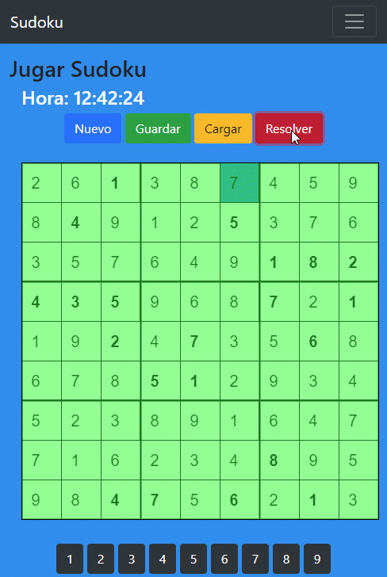

# Sudoku

Juego de Sudoku construido con la arquitectura MEAN (MongoDB, Express, Angular 4, Node.js). Incluye generador/solucionador de sudokus, autenticacion con JWT y un tablero interactivo dibujado con p5.js.

## Requisitos

- [Docker](https://docs.docker.com/get-docker/) y Docker Compose

## Ejecutar en entorno local

1. Clonar el repositorio:

```bash
git clone https://github.com/alonsocoding/Sudoku_Game
cd Sudoku_Game
```

2. Levantar los servicios:

```bash
docker-compose up
```

Esto levanta:
- **MongoDB** en el puerto `27017`
- **Backend (API)** en el puerto `8080` con la app Angular servida en `http://localhost:8080`

3. Abrir en el navegador:

```
http://localhost:8080
```

### Comandos utiles

| Accion | Comando |
|---|---|
| Levantar en background | `docker-compose up -d` |
| Detener servicios | `docker-compose down` |


## Stack

- **Backend:** Node.js + Express + Mongoose + JWT
- **Frontend:** Angular 4 + Bootstrap 4 + p5.js
- **Base de datos:** MongoDB 8
- **Infraestructura:** Docker + Docker Compose


